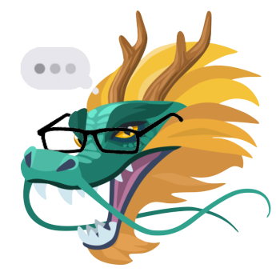

<div align='center'>
  </img>
</div>
<h1 align='center'>
  DMs and Dragons
</h1>

<p align='center'>A Facebook Messenger bot for creative, immersive and interactive storytelling in the age of online messaging.
</p>

## 🚀 Quick start

1.  **Clone this repository and run yarn.**
    
    ```zsh
    $ git clone https://github.com/faishasj/dms-and-dragons-webview
    $ cd dms-and-dragons-webview
    $ yarn
    ```

1. **Setup the environment variables.**

   The names of the variables that are required are in default.env. Make sure to add them in your .env.

1. **Run the development server.**

    ```zsh
    $ yarn start

If you would like to tunnel the webview, follow the instructions for developing with ngrok in the [webhook repository](https://github.com/faishasj/dms-and-dragons-webhook) for DMs and Dragons.
